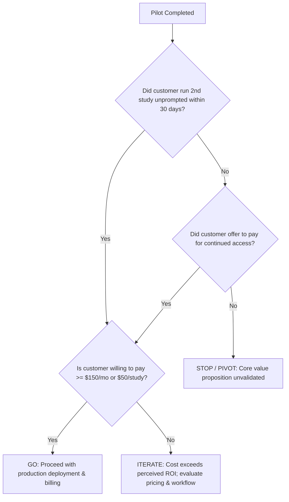

# JAMS — Private Pilot Playbook & Customer Discovery Plan

## 1. Executive Summary & Status Classification

JAMS implements a granted patent (*"Artificial Intelligence Assisted Method for Measuring and Quantifying Physical Effort, Cognitive Effort, and Sentiment While Performing a Task"*). The product processes video recordings (screen capture + audio narration) of users executing software tasks to produce synchronized, timestamped measures of effort and sentiment, an adjustable Effort Score, and an interactive report with video deep links.

As documented in the September 5, 2026 project review, JAMS has demonstrated substantial prototype functionality, but it is **not yet ready for unattended paid launch**. To build a viable, sustainable business, engineering expansion must be paired with disciplined customer discovery and empirical validation.

### Four-Tier Status Classification Framework

To eliminate ambiguity between code existence and validated market utility, the repository tracks all capabilities across four distinct tiers:

1. **Implemented (Code in Repo):** The feature or component exists in source code within `apps/web/` or `worker/` and is merged into `master`.
2. **Locally Tested (Verified in Local Harness):** The capability has executed in local automated tests, mock environments, or synthetic fixture runs. *Crucially, local testing does not prove integration under live network conditions, resilience to real-world edge cases (e.g., audio offsets, speech accents), or scalability on cloud SKUs.*
3. **Deployed (Running on Production Infrastructure):** The component is provisioned, configured, and operating in a live Azure cloud environment with managed identities, production databases, and monitoring.
4. **Customer-Validated (Proven with Real External Users):** The workflow has been repeatedly utilized by target external buyers using their own consented data, producing verified business outcomes and demonstrated willingness to pay.

### Component & Feature Status Inventory

| Area / Feature | Implemented | Locally Tested | Deployed | Customer-Validated | Status Notes & Known Gaps |
|---|:---:|:---:|:---:|:---:|---|
| **F0 Delegation Tooling** | ✅ | ✅ | N/A | N/A | Codex & Copilot CLI skills in repo; active in workflow. |
| **F1 App Shell & Demo Report** | ✅ | ✅ | ❌ | ❌ | Hand-authored demo report renders; local tests pass. Deployed hosting deferred. |
| **F2 Upload & Video Library** | ✅ | ✅ | ❌ | ❌ | Direct Blob upload with SAS; verified against Azurite. No production quotas. |
| **F3 Pipeline Spine (Probe, Scenes, Whisper)** | ✅ | ⚠️ Partial | ❌ | ❌ | Whisper INT8 & AdaptiveDetector implemented. **Gaps:** Audio offset bug (~1.94s drift), 2-vCPU ACA CPU benchmark unexecuted, queue race. |
| **F4 Sentiment, Segmentation, Scoring** | ✅ | ⚠️ Partial | ❌ | ❌ | DistilBERT-SST2 ONNX & rule segmentation. **Gaps:** SST-2 misclassifies neutral software narration as negative; missing data scores as low effort. |
| **F5 Processing Delight** | ✅ | ✅ | ❌ | ❌ | Skeletons, ETA calculations, measures query route implemented. |
| **F6a Re-runs, Sharing, Export** | ✅ | ⚠️ Partial | ❌ | ❌ | Versioned re-runs, tokenized sharing, CSV/JSON export. **Gaps:** Web DB role has broad token select permissions; share links persist after org deletion. |
| **F6b LLM Segment Labeling** | ✅ | ✅ | ❌ | ❌ | Feature-flagged; implemented via OpenRouter proxy (default off). |
| **F7 Comparison v1** | ✅ | ⚠️ Partial | ❌ | ❌ | Side-by-side run comparison with score deltas. **Gaps:** Positional segment alignment; older runs use historical snapshots. |
| **F8 Billing & Quotas** | ❌ | ❌ | ❌ | ❌ | **Deferred by design.** Automated Stripe billing held until pilot validates willingness to pay. Admission quotas needed for pilot. |
| **F9a Postgres RLS** | ✅ | ⚠️ Partial | ❌ | ❌ | DDL migrations applied; bypasses exist for worker role; live multi-tenant concurrency unverified. |
| **F9b Admin Config Editor** | ✅ | ✅ | ❌ | ❌ | Admin UI for per-run config overrides. |
| **F10 Physical CV / Telemetry** | ⚠️ PR #2 | ❌ | ❌ | ❌ | **FROZEN.** Clicks/scrolls/telemetry exploration held behind explicit pilot validation gates. |
| **Azure Cloud Infrastructure** | ❌ | ❌ | ❌ | ❌ | **Deferred by decision.** No Azure resources provisioned; operating locally via Docker Compose (Postgres + Azurite). |

---

## 2. Target Buyer & Core Workflow Hypothesis

### Primary Buyer Persona
- **Role:** Senior/Lead UX Researcher (UXR), Director of User Experience, or Principal/Owner of a boutique UX research agency (3–15 researchers).
- **Context:** Conducts frequent evaluative usability studies comparing digital product workflows (e.g., checkout funnels, SaaS onboarding sequences, configuration settings, or redesign vs. competitor benchmarks).
- **Core Pain Point:** In evaluative testing, researchers collect hours of screen and audio recordings. Synthesizing this video data is painfully manual—researchers scrub video at 1.5x speed, manually tally confusion moments and task times, and struggle to defend their findings against skeptical product and engineering stakeholders who view qualitative feedback as "just researcher opinion."

### Core Workflow Hypothesis
```
Target Workflow: Software Variant Usability Comparison
[Version A (Baseline / Current / Competitor)] vs. [Version B (Redesign / Candidate)]
```

> **The Hypothesis:**
> If a UX researcher uploading paired video recordings of participants executing the same task under Version A and Version B receives an automated, synchronized comparison of physical pacing, cognitive context-switching, and utterance-level sentiment with deep-linked video proof:
> 1. They will reduce their qualitative synthesis time by **at least 50%**.
> 2. They will achieve **higher stakeholder acceptance** of friction findings because observations are tied directly to objective, timestamped metrics rather than subjective notes.
> 3. They will demonstrate **willingness to pay** for continued access once the pilot concludes.

### Disqualified Segments (Out of Scope for Pilot)
- **General Meeting / Podcast Summaries:** JAMS is not a general transcription or meeting notes tool (e.g., Otter, Fathom).
- **Broad Consumer Content:** Social media video analysis, marketing analytics, or unstructured vlogs.
- **Biometric / Emotion AI Claims:** We do not track facial expressions, pulse, or pupil dilation via webcam.
- **Unmoderated Participant Sourcing:** JAMS does not recruit or pay study participants; the buyer brings their own session recordings.

---

## 3. Comparison with Existing Buyer Workflows

To establish genuine incremental value, JAMS must be positioned relative to the tools UX researchers currently use:

| Dimension | Participant Platforms (UserTesting, Maze) | Repository & Synthesis (Dovetail) | Manual Ad-Hoc Stack (VLC/Loom + Sheets + Miro) | JAMS (Private Pilot Scope) |
|---|---|---|---|---|
| **Primary Job to be Done** | Recruit participants and capture unmoderated task sessions. | Organize qualitative research tags, quotes, and insights across studies. | Free-form review and note-taking on a zero-software budget. | **Algorithmic effort quantification & variant comparison with video deep links.** |
| **Video Processing** | Cloud storage, raw transcription, automated clip creation via keyword search. | Transcription, qualitative tagging by keyword, manual highlight reels. | Manual playback scrubbing at 1.5x speed; manual timestamp copy-paste. | **Automated context-switch detection, word-level audio alignment, utterance sentiment.** |
| **Effort & Cognitive Load** | Post-task survey proxies only (e.g., SUS, SEQ, System Usability Scale). | None (researcher must interpret and tag sentiment manually). | Subjective researcher impression written in spreadsheet cells. | **Objective, observable physical/cognitive/sentiment proxies with transparent breakdown.** |
| **Variant Comparison** | Side-by-side metric tables (completion rate, time-on-task, SUS score). | Cross-project tag search; manual juxtaposition of findings. | Manually aligned spreadsheet rows; side-by-side video windows. | **Segment-aligned timeline comparison with differential Effort Score calculation.** |
| **Evidence Durability** | Hosted video player behind platform subscription paywall. | Repository highlight reel linked to project tags. | Local MP4 files or unindexed Loom links. | **Canonical timestamped measures, self-contained report, exportable data (CSV/JSON).** |
| **JAMS Differentiation** | *Complements:* Ingest videos recorded on UserTesting/Maze to analyze friction deeply. | *Complements:* Export JAMS timestamped findings into Dovetail as structured evidence. | *Replaces:* Eliminates manual scrubbing and timestamp logging for comparative tasks. | **The specialized measurement engine for comparative task effort.** |

---

## 4. Discovery Interview & Paid-Pilot Protocol

### Phase 1: Discovery Interview Script (45 Minutes)

#### Objective
Determine if the prospect regularly conducts comparative software task research, experiences severe synthesis bottlenecks, and has authority/budget to adopt new tooling.

#### Screening & Warm-Up (10 min)
1. "Could you walk me through the last evaluative usability study you ran where you compared two designs, an old vs. new flow, or your product against a competitor?"
2. "How many participant sessions did you record, and how long was each session?"
3. "What tools did you use to capture the sessions (e.g., UserTesting, Zoom, Loom, Lookback)?"

#### Friction & Synthesis Deep Dive (15 min)
4. "Once the recordings were completed, what was your exact workflow for analyzing them?"
5. "How many hours did you personally spend watching and timestamping videos versus preparing the final presentation?"
6. "When you report that 'Users struggled on the checkout page,' how do product managers or engineering leads respond? Do they ever push back on qualitative findings as subjective or cherry-picked?"
7. "Have you tried automated transcription or AI summarization tools? Where did they fall short for comparative task analysis?"

#### Tooling & Commercial Reality (10 min)
8. "What tools does your team currently pay for in your research stack (e.g., Dovetail, UserTesting, Figma)? Who signs off on software purchases under $2,000/year?"
9. "If software could take 10 task recordings from Version A and 10 from Version B, automatically identify every screen context switch and frustration cue, and align them side-by-side with click-to-seek video proof, how would that change your delivery timeline?"

#### Pilot Invitation & Data Gate (10 min)
10. "We are accepting three teams into an intensive 4-week private pilot for an upcoming study. We provide full setup, analysis, and engineering support. In exchange, you run one active comparative study, share anonymized participant videos under NDA, and evaluate the reports with your team. Would you be open to reviewing the pilot criteria?"

---

### Phase 2: Pilot Qualification & Admission Gates

A prospect is admitted to the private pilot only if they pass all five gates:

- [ ] **Gate 1 (Active Study Fit):** Prospect has an evaluative usability study scheduled within the next 30 days comparing at least two digital task variations (e.g., baseline vs. redesign, or competitor comparison).
- [ ] **Gate 2 (Video Format Compatibility):** Video format consists of desktop/web screen recordings with clear English audio narration, duration <= 15 minutes per task session, 5–15 participant recordings total.
- [ ] **Gate 3 (Data Governance & Consent):** Prospect confirms participant consent permits analysis by third-party processing infrastructure under a standard confidentiality/DPA agreement.
- [ ] **Gate 4 (Stakeholder Access):** Researcher agrees to share the final JAMS report/comparison with their direct product/engineering stakeholders and participate in a joint debrief.
- [ ] **Gate 5 (Commercial Intent):** Prospect agrees to a structured paid pilot commitment ($500–$1,000 deposit or study fee, creditable toward an annual subscription) or an explicit executive-backed conditional purchase order upon reaching agreed value milestones. *(Note: Actual fee level to be decided by owner; free pilots are prohibited to avoid non-binding feedback).*

---

### Phase 3: Weekly Milestone Cadence (4-Week Pilot)

```mermaid
gantt
    title Private Pilot 4-Week Execution Timeline
    dateFormat  X
    axisFormat Day %d
    section Onboarding
    Kickoff & Org Setup        :active, 0, 3
    Baseline Upload (Ver A)    :active, 3, 7
    section Analysis
    Baseline Review & Weights  :8, 14
    Redesign Upload (Ver B)    :15, 18
    section Comparison
    Side-by-Side Comparison    :18, 22
    Stakeholder Presentation   :22, 25
    section Evaluation
    ROI Review & WTP Decision  :25, 28
```



- **Week 1: Onboarding & Baseline Ingest**
  - Execute DPA and configure pilot organization.
  - Upload Version A (baseline) participant recordings.
  - Validate probe, transcription, and scene detection outputs.
- **Week 2: Baseline Synthesis & Tuning**
  - Researcher reviews Version A reports, verifies timestamp accuracy, audits transcript, and inspects context switches.
  - Tune weight profile if necessary (e.g., adjust context switch sensitivity for high-scroll pages).
  - Record baseline synthesis time (hours spent).
- **Week 3: Redesign Ingest & Comparison**
  - Upload Version B (redesigned workflow) recordings.
  - Generate Comparison v1 runs matching baseline tasks to redesign tasks.
  - Review differential Effort Scores and segment-by-segment delta evidence.
- **Week 4: Stakeholder Readout & Commercial Decision**
  - Deliver findings to product/engineering team using JAMS deep-linked reports.
  - Structured pilot debrief interview.
  - Evaluate against Repeat-Use and Willingness-to-Pay decision criteria.

---

## 5. Measurable Incremental-Value Outcomes

To prove that JAMS provides substantial value beyond status-quo tools, the pilot tracks four quantitative outcome metrics:

```
1. Synthesis Time Saved = (Baseline Synthesis Hours - JAMS Synthesis Hours) / Baseline Synthesis Hours
   Target: >= 50% reduction in researcher time required to produce a final report.

2. Stakeholder Evidence Acceptance = (Accepted Findings / Total Presented Findings)
   Target: >= 80% of identified friction points accepted by engineering/product without requesting raw video re-checks.

3. Decision Velocity = Days from last participant session to final design decision
   Target: Reduced from typical 10–14 days to <= 3 business days.

4. Defect Discovery Rate = Number of high-friction micro-moments (confusion, excessive back-tracking)
   Target: JAMS flags at least 2 actionable friction moments per task that were missed in manual note-taking.
```

---

## 6. Repeat-Use & Willingness-to-Pay (WTP) Decision Criteria

At the conclusion of the 4-week pilot, JAMS leadership evaluates the commercial viability signal based on strict, non-speculative criteria:



### Explicit Decision Gates
1. **Strong Commercial Signal (GO):**
   - At least 2 of 3 pilot organizations execute a second study within 30 days of pilot completion.
   - The buyer approves a paid ongoing subscription (or per-study package) at a price point that yields >= 75% gross margin over unsubsidized COGS.
   - Stakeholders confirm that the comparison report directly influenced a product roadmap or design decision.
2. **Ambiguous Signal (ITERATE):**
   - Researchers praise the report interface and timestamp links, but report that sentiment analysis is too noisy for client presentations, or that segment alignment required too much manual correction.
   - *Action:* Do not expand to F10. Address measurement validity, refine model calibration, and test again on a single follow-on pilot.
3. **Negative Commercial Signal (KILL / PIVOT):**
   - Researchers revert to manual notes, citing lack of trust in the Effort Score.
   - Zero pilot participants agree to pay an unsubsidized fee after the pilot ends.
   - *Action:* Halt further SaaS development. Review whether the patent method is better commercialized as an enterprise consulting toolkit, a plugin to existing platforms (e.g., Dovetail app), or archived.

---

## 7. Measurement-Validation Study Protocol

The September 5, 2026 project review demonstrated critical empirical limitations in the prototype:
- **Finding 5:** Missing analysis data scored as low effort (score of 1/100) rather than being flagged as unavailable.
- **Finding 6:** Binary sentiment (DistilBERT-SST2 trained on movie reviews) scored neutral task narration negatively (e.g., *"I clicked the blue button"* scored −0.68; *"I am entering the account number"* scored −0.97). Speech rate saturated at ~40.5 wpm; context switches saturated at ~2.72/min.
- **Finding 7:** Changing weights mutated stored profiles, causing historical reports and comparisons to disagree.

Before commercial claims are made, the following empirical validation study protocol must be executed:

### Dataset Curation & Holdout Design
- **Dataset Composition:** 30 consented recordings of diverse software tasks (e.g., eCommerce checkout, SaaS CRM entry, cloud console provisioning, tax form completion).
- **Stratified Split:**
  - **Calibration Set (50% — 15 videos):** Used to tune AdaptiveDetector thresholds, cue regexes, and scoring normalizers.
  - **Held-Out Test Set (50% — 15 videos):** Partitioned strictly by participant and software task. **Zero parameter tuning or prompt adjustments permitted against this set.**
- **Edge-Case Inclusion Matrix:**
  - Neutral narration (calm procedural statements).
  - Silent task periods (thinking time without speech).
  - Accents and domain jargon (technical terms).
  - Fast scrolling on long pages vs. true application context switches.
  - Multi-window and multi-monitor screen switches.
  - Artificially introduced audio stream offsets (verifying CFR/offset handling).

### Ground-Truth Annotation Protocol
- Two independent human raters (trained UX researchers) review all 30 videos.
- **Annotated Events:**
  - Exact millisecond timestamps of true task switches / sub-tasks.
  - Exact timestamps of true application / context transitions.
  - Utterance-level friction / frustration ratings (1 = Calm/Positive, 0 = Neutral/Procedural, −1 = Frustrated/Confused).
  - Overall task cognitive load assessed via standard post-task instruments: Single Ease Question (SEQ, 1–7) and NASA Task Load Index (NASA-TLX, 6 dimensions).
- **Inter-Rater Reliability:** Inter-annotator agreement measured via Cohen’s kappa ($\kappa$). Annotation is accepted only if $\kappa \ge 0.75$. Disagreements resolved by a third rater.

### Validation Acceptance Thresholds

| Pipeline Stage | Metric | Target Threshold | Validation Purpose |
|---|---|:---:|---|
| **Audio Extraction** | Stream Time Offset Error | $\le 50\text{ ms}$ | Ensures audio origin matches video origin perfectly across formats. |
| **Transcription** | Word Error Rate (WER) | $< 5.0\%$ | Baseline accuracy on clear English audio; document degradation on accented clips. |
| **Context Switches** | Precision & Recall | $\ge 80\%$ Precision / $\ge 80\%$ Recall | Ensures scrolling is not misclassified as scene cuts (AdaptiveDetector tuning). |
| **Sentiment Proxy** | False Negative Rate on Neutral Narration | $< 10.0\%$ | Prevents procedural narration (*"I click submit"*) from being marked as user frustration. |
| **Effort Score Correlation** | Spearman's $\rho$ vs. NASA-TLX & SEQ | $\rho \ge 0.65$ ($p < 0.01$) | Validates that higher Effort Scores correlate with validated subjective workload. |
| **Cross-Stage Timebase** | Max Seek Error to Video Event | $\le 250\text{ ms}$ | Guarantees the patent promise of instant, accurate video deep-linking. |

*Note: All validation results must be published in `docs/benchmarks/` with exact fixture hashes. JAMS documentation must never claim validated accuracy until this protocol is executed and passed.*

---

## 8. Privacy, Data-Flow & Subprocessor Disclosure Checklist

Screen recordings of software tasks routinely expose sensitive data: customer personal information, proprietary enterprise application layouts, financial data, or accidental password entries. Private pilot customers require complete transparency regarding data transit and storage.

### End-to-End Data Flow Architecture

```mermaid
flowchart LR
    subgraph Client [Customer Browser]
        Browser[Upload Component]
        Player[Vidstack Player]
    end

    subgraph AzureStorage [Azure Blob Storage]
        WriteSAS[Direct Write SAS Blob]
        ReadSAS[Direct Read SAS Stream]
        DerivedBlobs[WAV / MP4 / Thumbs]
    end

    subgraph Compute [Azure Container Apps]
        Web[jams-web API]
        Worker[jams-worker Job]
    end

    subgraph LocalInference [In-Worker Local CPU Models]
        Whisper[faster-whisper INT8]
        PyScene[PySceneDetect]
        DistilBERT[DistilBERT-SST2 ONNX]
    end

    subgraph ExternalLLM [Optional Flagged LLM]
        OpenRouter[OpenRouter API Proxy]
        Anthropic[Anthropic Claude 3 Haiku]
    end

    subgraph DB [Azure Database for PostgreSQL]
        Postgres[(Relational DB / RLS)]
    end

    Browser -- Direct 15-min Write SAS --> WriteSAS
    Web -- Mints SAS & Enqueues --> Worker
    Worker -- Downloads Video --> WriteSAS
    Worker -- Extracts & Uploads --> DerivedBlobs
    Worker -- In-Memory Processing --> LocalInference
    LocalInference -- Canonical Measures --> Postgres
    Worker -. Text Utterances Only .-> OpenRouter -. Proxy .-> Anthropic
    Player <-- Direct 60-min Read SAS -- ReadSAS
```

### Complete Subprocessor Disclosure Table

| Subprocessor | Role in JAMS | Data Sent / Processed | Data Transit Security | Storage Location | Default Setting |
|---|---|---|---|---|---|
| **Microsoft Azure** | Infrastructure Host (ACA, Blob Storage, PostgreSQL Flexible Server) | Raw video/audio files, derived media (WAV, keyframes, normalized MP4), application metadata, user accounts, measures. | TLS 1.3 in transit; AES-256 at rest. Managed identity access; no static storage keys. | East US (or selected Azure region) | Mandatory |
| **Clerk, Inc.** | User authentication, organization tenancy, session tokens. | User email, display name, organization memberships, login IP. | TLS 1.3, encrypted session JWTs, Svix-verified webhook signatures. | United States | Mandatory |
| **OpenRouter** *(if LLM labeling enabled)* | API proxy for optional segment naming and merge recommendations. | **Text transcripts and segment timestamp boundaries only.** No raw video or audio frames are ever transmitted. | HTTPS / TLS 1.3 with API token authorization. | United States | **Optional (Default: OFF)** |
| **Anthropic, PBC** *(via OpenRouter)* | Underlying LLM provider executing segment naming. | Segment transcript text snippets. | Encrypted API transit via OpenRouter proxy. | United States | **Optional (Default: OFF)** |

### Customer Data Protection Checklist
- [ ] **Upload Hygiene Guidelines Provided:** Customer instructed to use test/staging accounts, dummy data, and avoid displaying passwords or personal data during usability sessions.
- [ ] **Pilot Data Protection Agreement (DPA):** Signed DPA specifying tenant isolation via Clerk `withOrg()` and database row segregation.
- [ ] **Explicit OpenRouter Disclosure:** If LLM segment labeling is toggled on, customer must explicitly opt in with knowledge of the OpenRouter/Anthropic data path.
- [ ] **Zero Model Training Commitment:** Explicit confirmation that customer video, audio, and transcript data is **never** used to train foundation models (Whisper weights are static local INT8; ONNX is static; OpenRouter/Anthropic requests carry zero-data-retention headers where supported).

---

## 9. Support, Retention & Deletion Expectations

### Private Pilot Support SLA
- **Communication Channel:** Dedicated private Slack/Teams channel with JAMS engineering and email support (`support@jams.dev`).
- **Hours of Coverage:** Business days (Monday–Friday), 9:00 AM – 6:00 PM Pacific Time.
- **Target Response Times:**
  - Critical (analysis pipeline failure, upload broken): <= 4 business hours.
  - Normal (report usability questions, weight tuning): <= 1 business day.
- **Escalation Path:** Direct access to founder/lead engineer; daily review of failed runs via `/admin/runs`.

### Retention & Lifecycle Policies
1. **Raw Video Files (Original Uploads):**
   - Retained in Azure Blob Storage Hot tier for **30 days** by default.
   - At day 31, customer can elect to: (a) delete the original video while retaining derived measures/transcripts, (b) transition to Azure Blob Cool/Cold tier for long-term audit, or (c) retain on Hot tier under an active storage quota.
2. **Derived Analysis Artifacts (Normalized MP4, WAV, Keyframes):**
   - Co-located with video lifecycle; purgable independently to save storage costs.
3. **Canonical Measures, Transcripts & Scores:**
   - Retained indefinitely in PostgreSQL while the organization account remains active.
   - Exportable at any time via JSON/CSV export.

### Deletion Mechanics & Hardening (Addressing Review Findings 11 & 12)
- **Single-Video Deletion:**
  - Triggered by user from Video Library (`DELETE /api/videos/:id`).
  - Atomically marks video deleted in DB, cascades deletion to `analysis_runs`, `measures`, `segments`, and `effort_scores`.
  - Enqueues background blob deletion job to purge `videos/{org_id}/{video_id}/*` from Azure Storage.
- **Organization Deletion:**
  - Triggered via Clerk org deletion webhook.
  - **Immediate Invalidation:** Public share links revoked immediately; web app denies any fresh SAS generation for the tenant.
  - **Asynchronous Storage Purge:** Complete purge of all Azure Blob storage prefixes matching `videos/{org_id}/*`.
- **SAS Token Expiration Boundary:**
  - Active read SAS tokens have a hard expiration of **60 minutes**. Customers must be informed that while revoking database access prevents *new* link creation immediately, an already-issued browser URL remains readable until its 60-minute Azure timestamp expires.

---

## 10. Unsubsidized Unit Economics & Scenarios

### The Sponsorship Illusion
Azure sponsorship credits currently cover cloud infrastructure cash outlays. However, commercial pricing and viability cannot be evaluated using subsidized costs. The pilot must instrument and calculate **true, unsubsidized Cost of Goods Sold (COGS)** per processed video minute.

### Key Cost Drivers
1. **Compute (Worker ACA Job):** 2 vCPU / 4 GiB running at ~$0.000048/vCPU-s + ~$0.0000053/GiB-s.
   - Execution time: ~0.4x real-time (a 10-minute video processes in ~4 minutes = 240 seconds).
   - Compute cost per 10-min video: $0.028.
2. **Compute (Web App Base):** Next.js ACA container (0.5 vCPU / 1 GiB) shared across tenants.
3. **Storage (Azure Blob):** Hot tier @ ~$0.018/GB-month.
   - 10-min 1080p video @ 3 Mbps = ~225 MB original.
   - Derived WAV (16kHz mono) = ~19 MB.
   - Normalized MP4 + keyframes = ~150 MB.
   - Total storage per video: ~0.4 GB = ~$0.0072/month.
4. **Bandwidth (Egress):** Direct Blob playback streaming @ ~$0.087/GB.
   - Watching a 10-minute video twice: ~0.45 GB egress = ~$0.039.
5. **Database (PostgreSQL Flexible Server):** Base server (~$15/mo) + storage growth (~150 measures rows per video minute).
6. **Optional LLM Calls (OpenRouter):** ~$0.005–$0.02 per video when segment naming is toggled on.

### Unsubsidized Cost Scenarios Matrix

| Scenario | Video Duration | Resolution / Bitrate | Retention Period | Reanalysis Rate | Estimated Total Direct COGS (per video) | Implied Floor Price (@ 80% Gross Margin) |
|---|:---:|:---:|:---:|:---:|:---:|:---:|
| **A: Quick Task** | 5 minutes | 720p (1.5 Mbps) | 30 days | 1x (initial) | **$0.035** | **$0.18** |
| **B: Standard Usability** | 15 minutes | 1080p (3.5 Mbps) | 60 days | 1x (initial) | **$0.145** | **$0.73** |
| **C: High-Res Heavy Review** | 15 minutes | 1080p (4.0 Mbps) | 90 days | 3x (re-runs) | **$0.385** | **$1.93** |
| **D: Edge Max Cap** | 20 minutes | 4K (12.0 Mbps) | 180 days | 2x (re-runs) | **$1.120** | **$5.60** |

### Commercial Pricing Implications
- Even with conservative 4x reanalysis and heavy playback, raw compute/storage COGS per 15-minute video remains under **$0.50**.
- Therefore, infrastructure COGS is **not** the primary pricing driver; **support, onboarding, domain trust, and software R&D amortization** dominate.
- A pilot offering 10 video analyses per study at $250–$500/study yields gross software margins well above 90%, confirming that pricing is constrained by buyer value perception rather than Azure compute costs.

---

## 11. Freeze on Broader F10 Expansion Behind Evidence Gates

### Current State: PR #2 (`f10-cv-providers`)
Pull Request #2 introduces substantial experimental computer vision code:
- Mouse click detection (cursor shape analysis & circle-expansion heuristics).
- Keypress detection (text input bounding box change tracking).
- Scroll velocity estimation (dense optical flow / phase correlation).
- Complex OCR concepts and cognitive effort models.

### Freeze Policy & Justification
As established in the September 5, 2026 project review:
1. **Foundational Gaps Must Come First:** Core timestamp integrity (Finding 1), durable dispatch (Finding 2), worker claims (Finding 3), and score saturation/bias (Findings 5 & 6) remain unclosed. Adding more unbenchmarked CV stages directly compounds pipeline instability.
2. **Customer Demand is Unproven:** We have zero empirical evidence that UX researchers need micro-level click/scroll tallies to make task redesign decisions. The primary user pain is macro-level: understanding sub-task segmentation, context switches, and emotional dips.
3. **Execution Freeze:**
   - **All development on PR #2 (`f10-cv-providers`) and downstream F10 scope is FROZEN immediately.**
   - PR #2 remains on hold in draft state; no further CV providers will be merged into `master`.

### Explicit Unfreezing Gates

Broader F10 expansion will be resumed **only** when all four of the following gates are satisfied:

- [ ] **Gate 1 (Reliability & Timebase Foundation):** Review Findings 1–4 and 9–10 are resolved. Audio start offset is eliminated ($\le 50\text{ ms}$ error in CI); worker dispatch is durable; worker claim fencing is verified under duplicate delivery.
- [ ] **Gate 2 (Measurement Validation Holdout):** The measurement validation study protocol (Section 7) is executed on the 30-video dataset. AdaptiveDetector achieves $\ge 80\%$ precision/recall; DistilBERT-SST2 false-negative rate on neutral narration is $< 10\%$.
- [ ] **Gate 3 (Customer Demand Evidence):** At least two active private pilot customers explicitly state in debrief interviews that macro-effort (time, context switches, narration sentiment) is insufficient, and provide specific examples where click/scroll micro-telemetry would alter their design decision.
- [ ] **Gate 4 (Commercial WTP Gate):** At least two pilot organizations execute paid commercial renewals under unsubsidized pricing.

---

## 12. Unresolved Owner Decisions

The following structural and business decisions cannot be resolved by autonomous engineering and are cataloged for explicit decision by the product owner (Chris):

| # | Decision Item | Context & Tradeoffs | Owner Options | Decision Status |
|---|---|---|---|:---:|
| **1** | **Private Pilot Pricing Model** | Free pilots generate tire-kickers and low-urgency feedback; paid pilots prove commercial intent but increase sales friction. | **A:** $500–$1,000 paid pilot fee (creditable toward annual plan).<br>**B:** Free pilot conditioned on signed PO with agreed value gates.<br>**C:** Completely free pilot (unconditionally). | **PENDING OWNER DECISION** |
| **2** | **LLM Subprocessor Routing** | F6b segment labeling currently calls OpenRouter.ai (`anthropic/claude-3-haiku`). PLAN.md originally envisioned direct Anthropic API. | **A:** Retain OpenRouter (disclose in DPA; easy model switching).<br>**B:** Migrate to direct Anthropic API (fewer subprocessor hops).<br>**C:** Migrate to Azure OpenAI (consolidates data inside Azure tenant). | **PENDING OWNER DECISION** |
| **3** | **Cloud Deployment Authorization** | Code is currently developed and tested locally (docker-compose: Azurite + Postgres). Azure provisioning has been deferred to conserve credits. | **A:** Authorize initial Bicep staging deployment for pilot kickoff.<br>**B:** Maintain local-only testing until 3 pilot customers sign DPAs. | **PENDING OWNER DECISION** |
| **4** | **Default Video Retention Window** | Retaining original videos on Hot Blob storage costs ~$0.018/GB-mo. Longer retention increases customer convenience but raises liability and storage costs. | **A:** 30 days default, then automatic purge of raw video.<br>**B:** 90 days default, then transition to Cool storage.<br>**C:** Indefinite retention while subscription is active. | **PENDING OWNER DECISION** |
| **5** | **Disposition of PR #2 (`f10-cv-providers`)** | Branch has open PR #2 exploring clicks/scrolls CV providers. | **A:** Keep PR #2 open in draft state as reference.<br>**B:** Close PR #2 with explicit cross-reference to this playbook's freeze gates.<br>**C:** Rebase PR #2 and continue CV development in parallel. | **PENDING OWNER DECISION** |
| **6** | **Pilot Customer Recruitment Channel** | Identifying the first 3 pilot prospects. | **A:** Direct founder outreach to existing network of UX research leads.<br>**B:** Cold outreach to boutique UX research agencies.<br>**C:** Public call for pilot participants on LinkedIn/Twitter. | **PENDING OWNER DECISION** |
